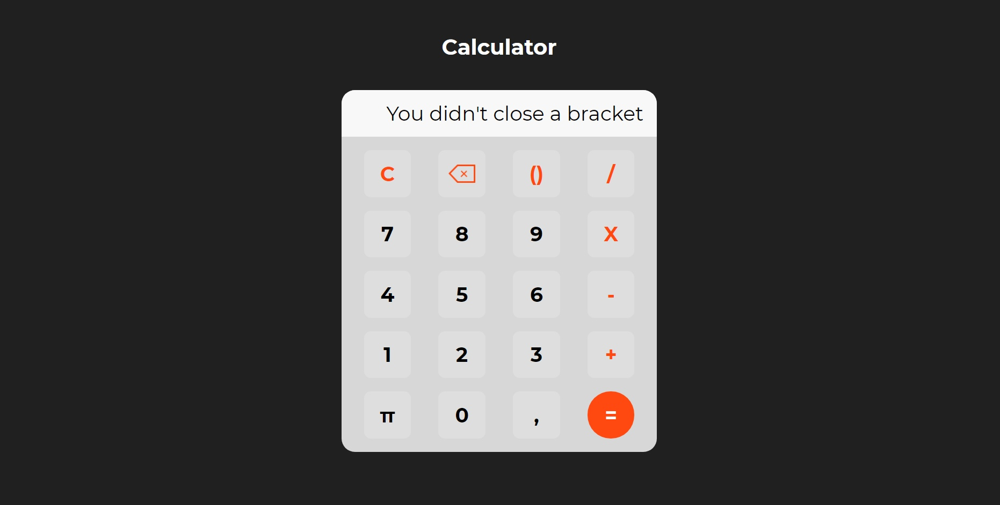

# Calculator

📠 Simple web-page with calculator  
It's able to multiply, diline, fold, subtract, and etc.  
If you'll forget to close a bracket, then it will be written there.
If you'll do some other mistake, then answer won't be showen.

For looking the work you should open file "main.html"  
Or Just go to the link for watch the video - how it works: https://youtu.be/h4bF1GP5n1Y
